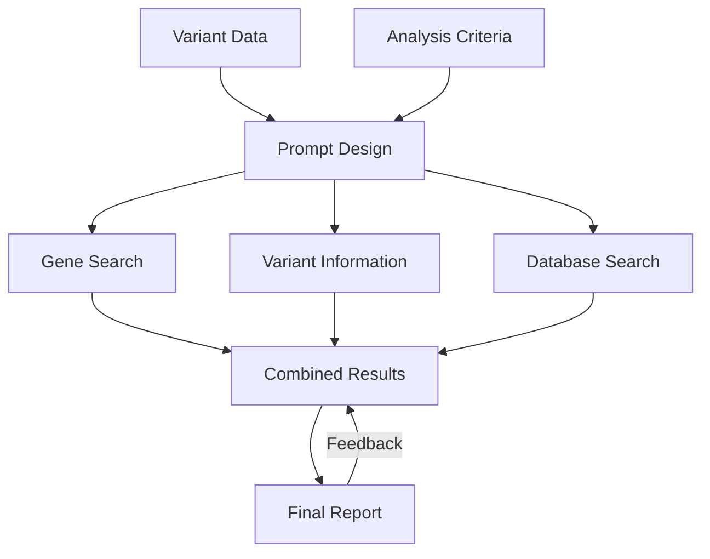

# genome analysis

<a target="_blank" href="https://cookiecutter-data-science.drivendata.org/">
    
</a>

analysis of genetic variants


[Documentation URL](https://yang-a1.github.io/gen_analysis/)




--------

# Project README

# Gene Analysis Module

This project provides a tool for processing gene variant data, generating informative summaries for each variant, and formatting the results in both Markdown and PDF formats. The tool integrates with OpenAI's API to generate detailed elaborations for gene symbols based on predefined prompts.

---

## Features

- **Variant Data Processing**:  
  Processes TSV files containing gene variant information, extracting and formatting key data such as gene symbols, allele frequencies, amino acid changes, and other related information.

- **Prompts and Gene Symbol Elaboration**:  
  Uses predefined prompts stored in a JSON file to generate elaborations for gene symbols through the OpenAI API. These elaborations provide additional insights into each variant.

- **Markdown and PDF Generation**:  
  Converts the processed variant data into a structured Markdown file. Additionally, generates a PDF report using custom CSS for styling.

- **Configuration Support**:  
  Configurable via environment variables, including the OpenAI API key, model parameters, and paths for raw data, interim data, and processed output. Configuration values are stored in a `.env` file for easy management.

---

## Requirements

- **Python**: Version 3.8 or higher  
- **Required Python packages**:
  - `openai`
  - `dotenv`
  - `pandas`
  - `numpy`
  - `re`
  - `logging`
  - `time`
  - `json`
  - `os`
  - `AzureOpenAI`

---

## Setup

### 1. Access the ARC Environment

SSH into the ARC (Advanced Research Computing) system at the University of Michigan:

```bash
ssh greatlakes.arc-ts.umich.edu
```
### 2. Load and Activate the Conda Environment

Load the Conda module:

```bash
module load python/anaconda
```
Activate the Conda environment that contains the necessary dependencies:
bash:

```bash
conda activate gene-analysis-env
```
If the environment is not already created, you can create it by running:
bash

```bash
conda create -n gene-analysis-env python=3.8 pandas numpy openai python-dotenv
conda activate gene-analysis-env
```
### 3. Clone the Repository

Clone this repository:
```bash
git clone https://github.com/yang-a1/gen-analysis-module.git
```
### 3. Set Up the Environment Configuration

Create a .env file in the root directory of the project, and add the following configuration variables:
```ini
OPENAI_API_KEY=your-api-key
model=gpt-35-turbo
API_VERSION=2024-06-01
prompts_json_file="prompts.json"
MAX_TOKENS_VALUE=150
TEMPERATURE_VALUE=0.7
```
### 4. Place Your Data Files
Ensure that your raw variant data files (in TSV format) are placed in the directory specified by the RAW_DATA_DIR variable in the .env file.

### 5. Place Your Data Files

Execute the script:

```bash
python gen_analysis.py
```
This will process the data files, generate Markdown outputs, and convert them to PDFs.


## Usage

- **Prompts**:  
  The module uses a `prompts.json` file to define the prompts for generating elaborations on gene symbols. You can modify this file to suit your needs.

- **Error Handling**:  
  The tool includes error handling for cases such as missing or empty input files and rate-limiting from the OpenAI API. If the rate limit is exceeded, the module will automatically retry after 60 seconds.

- **Output**:  
  The processed data is output in both Markdown (.md) and PDF formats. The output Markdown files are saved in the `PROCESSED_DATA_DIR`, while the PDFs are generated using custom CSS for formatting.

## License
This project is licensed under the MIT License. See the LICENSE file for details.