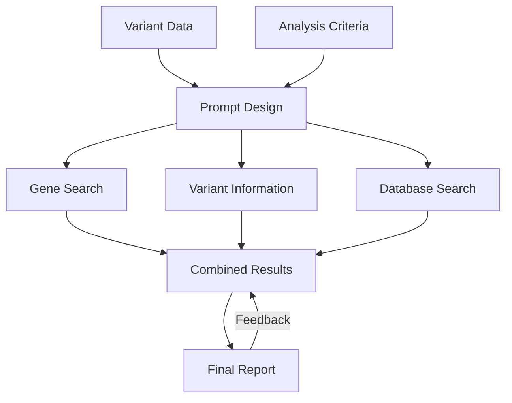

# genome analysis

<a target="_blank" href="https://cookiecutter-data-science.drivendata.org/">
    
</a>

analysis of genetic variants


[Documentation URL](https://yang-a1.github.io/gen_analysis/)




--------

# Project README

## Overview
This project involves a genetic analysis workflow, utilizing scripts and modules to process and analyze genetic data. The following sections detail the contents of the project, including scripts, modules, and their respective functionalities.

## Directory Structure

### `contrib/`
This folder contains utility scripts and additional resources to aid users in executing analyses.

- **`20241004_quickrun_gen_analysisV2.sh`**: A bash script that activates a conda environment and lists files in the raw data directory. It prompts the user for confirmation before running the `gen_analysis.py` script, which processes genetic data and generates reports in Markdown and DOCX formats.

- **`pandoc.sh`**: A simple script example for converting Markdown files to DOCX using Pandoc.

- **`rm_request_open_terminal.sh`**: A script to submit an interactive job to a SLURM scheduler, providing access to a terminal for executing commands.

### `gen_analysis_module/`
This module includes the core functionality for data processing and analysis.

- **`config.py`**: Configures project directories and loads environment variables. Sets paths for raw, processed, and external data.

- **`dataset.py`**: Contains a command-line interface for processing datasets, with customizable input and output paths.

- **`features.py`**: Similar to `dataset.py`, this script generates features from processed datasets and allows for path customization.

- **`gen_analysis.py`**: The main analysis script that reads TSV files, processes genetic variant information, and generates elaborated descriptions using the OpenAI API.

- **`plots.py`**: A placeholder for future plotting functionalities, designed to generate visual representations of the processed data.

### `tests/`
This directory includes test cases to ensure the functionality of the project.

- **`test_gen_analysis.py`**: Uses `pytest` to validate the existence of TSV files in the test data directory and tests the core functions for getting file paths and generating elaboration from prompts.

### `data/`
Contains various test cases in the form of TSV files used for validating the functionality of the scripts. Notable files include:

- **`empty.tsv`**
- **`extracol.tsv`**
- **`header.tsv`**
- **`malformed.tsv`**
- **`missingcol.tsv`**
- **`test_file_1.tsv`**
- **`test_file_2.tsv`**

## Usage
To run the analysis, follow these steps:
1. Navigate to the `contrib` directory.
2. Execute the `20241004_quickrun_gen_analysisV2.sh` script.
3. Confirm the continuation when prompted.
4. The analysis will be executed, generating outputs in the specified formats.

## SLURM Job Management
The project includes guidelines for submitting jobs to SLURM, with a focus on managing job numbers and ensuring the correct environment is activated for execution.

## Additional Notes
- Ensure that the necessary environment variables for the OpenAI API are set in the `.env` file.
- For any issues related to the SLURM job environment, refer to the provided commands and troubleshooting steps.


## Project Organization

```
├── LICENSE            <- Open-source license if one is chosen
├── Makefile           <- Makefile with convenience commands like `make data` or `make train`
├── README.md          <- The top-level README for developers using this project.
├── data
│   ├── external       <- Data from third party sources.
│   ├── interim        <- Intermediate data that has been transformed.
│   ├── processed      <- The final, canonical data sets for modeling.
│   └── raw            <- The original, immutable data dump.
│
├── docs               <- A default mkdocs project; see mkdocs.org for details
│
├── models             <- Trained and serialized models, model predictions, or model summaries
│
├── notebooks          <- Jupyter notebooks. Naming convention is a number (for ordering),
│                         the creator's initials, and a short `-` delimited description, e.g.
│                         `1.0-jqp-initial-data-exploration`.
│
├── pyproject.toml     <- Project configuration file with package metadata for gen_analysis_module
│                         and configuration for tools like black
│
├── references         <- Data dictionaries, manuals, and all other explanatory materials.
│
├── reports            <- Generated analysis as HTML, PDF, LaTeX, etc.
│   └── figures        <- Generated graphics and figures to be used in reporting
│
├── requirements.txt   <- The requirements file for reproducing the analysis environment, e.g.
│                         generated with `pip freeze > requirements.txt`
│
├── setup.cfg          <- Configuration file for flake8
│
└── gen_analysis_module                <- Source code for use in this project.
    │
    ├── __init__.py    <- Makes gen_analysis_module a Python module
    │
    ├── data           <- Scripts to download or generate data
    │   └── make_dataset.py
    │
    ├── features       <- Scripts to turn raw data into features for modeling
    │   └── build_features.py
    │
    ├── models         <- Scripts to train models and then use trained models to make
    │   │                 predictions
    │   ├── predict_model.py
    │   └── train_model.py
    │
    └── visualization  <- Scripts to create exploratory and results oriented visualizations
        └── visualize.py
```