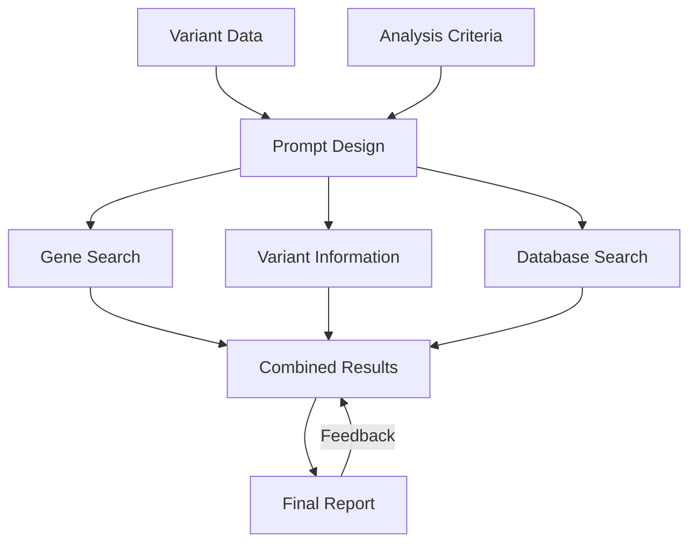

I apologize for that oversight. Here is the content in Markdown format:

---

# Genome Analysis

[](https://cookiecutter-data-science.drivendata.org/)

**Analysis of Genetic Variants**

---

## Overview

This project involves a genetic analysis workflow designed to process and analyze genetic data. It utilizes a set of scripts and modules to analyze genetic information, producing reports in multiple formats (including Markdown and DOCX). The project is highly extensible and customizable for various datasets.

---

## Project Organization

The project is organized into several key components, each serving a specific role in the analysis workflow.



---

## Project Structure

```
├── LICENSE            <- Open-source license if one is chosen
├── Makefile           <- Makefile with convenience commands like `make data` or `make train`
├── README.md          <- The top-level README for developers using this project.
├── data
│   ├── external       <- Data from third party sources
│   ├── interim        <- Intermediate data that has been transformed
│   ├── processed      <- The final, canonical data sets for modeling
│   └── raw            <- The original, immutable data dump
│
├── docs               <- A default mkdocs project; see mkdocs.org for details
│
├── models             <- Trained and serialized models, model predictions, or model summaries
│
├── notebooks          <- Jupyter notebooks. Naming convention is a number (for ordering),
│                         the creator's initials, and a short `-` delimited description, e.g.
│                         `1.0-jqp-initial-data-exploration`
│
├── pyproject.toml     <- Project configuration file with package metadata for gen_analysis_module
│                         and configuration for tools like black
│
├── references         <- Data dictionaries, manuals, and all other explanatory materials
│
├── reports            <- Generated analysis as HTML, PDF, LaTeX, etc.
│   └── figures        <- Generated graphics and figures to be used in reporting
│
├── requirements.txt   <- The requirements file for reproducing the analysis environment, e.g.
│                         generated with `pip freeze > requirements.txt`
│
├── setup.cfg          <- Configuration file for flake8
│
└── gen_analysis_module <- Source code for use in this project
    ├── __init__.py    <- Makes gen_analysis_module a Python module
    ├── data           <- Scripts to download or generate data
    │   └── make_dataset.py
    ├── features       <- Scripts to turn raw data into features for modeling
    │   └── build_features.py
    ├── models         <- Scripts to train models and then use trained models to make predictions
    │   ├── predict_model.py
    │   └── train_model.py
    └── visualization  <- Scripts to create exploratory and results-oriented visualizations
        └── visualize.py
```

---

## Execution Instructions

### Quick-Run Script

Execute the quick-run script by running the following command in your terminal:

```bash
./20241004_quickrun_gen_analysisV2.sh
```

Confirm the continuation when prompted. The script will activate the necessary environment and start processing the genetic data. The output will be generated in various formats, including Markdown and DOCX reports.

---

### SLURM Job Management

To submit SLURM jobs for the analysis, ensure that you have the correct environment set up by using the provided shell scripts. Submit jobs with the SLURM job scheduler for parallel processing or computational-heavy tasks. You can do this by using the provided `rm_request_open_terminal.sh` script.

---

## Directory Structure Details

### data/

Contains several test datasets in TSV format to validate the functionality of the scripts. Notable files include:

- `empty.tsv`: An empty test file.
- `extracol.tsv`: A test file with extra columns.
- `header.tsv`: A file with malformed headers.
- `malformed.tsv`: A file with incorrect data formatting.
- `missingcol.tsv`: A file with missing columns.
- `test_file_1.tsv` and `test_file_2.tsv`: Example test datasets.

### gen_analysis_module/

Core source code for data processing and analysis.

- `config.py`: Configures project directories and loads environment variables.
- `dataset.py`: Command-line interface for processing datasets.
- `features.py`: Generates features from datasets.
- `gen_analysis.py`: Main script for genetic analysis.
- `plots.py`: Placeholder for future plotting functions.

---

## Additional Notes

- Ensure that the necessary environment variables are set in the `.env` file before running any scripts.
- The project assumes the use of a Conda environment for dependencies. Make sure that the environment is activated before running the scripts.
- Troubleshooting for SLURM jobs can be found in the `rm_request_open_terminal.sh` script and its documentation.

---

## License

This project is open-source and licensed under the MIT License. See the LICENSE file for more details.

---